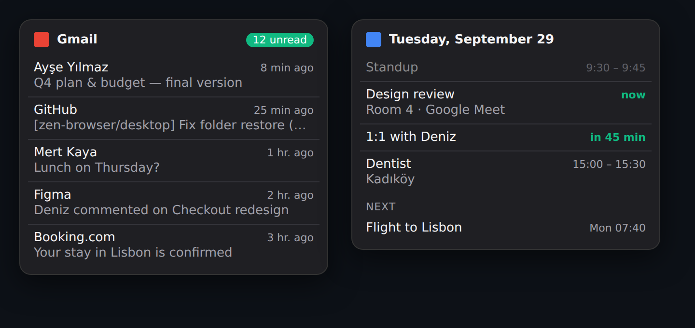

<div align="center">


# Zen Peek

**Hover an Essential, see what's inside.**

Arc-style previews for [Zen Browser](https://zen-browser.app): your latest mail, today's calendar, GitHub notifications, or a snapshot of the page. You don't have to switch tabs.



<br><sub>The Gmail and Calendar cards (a mock-up with sample data, drawn with the mod's own styles).</sub>

</div>

---

## What you get

Hover an Essential for half a second and a card pops out next to it:

| Essential | Preview | Setup |
| --- | --- | --- |
| **Gmail** | Unread count, your 5 latest unread mails (sender, subject, time). Click one to open it. | None: uses the Google account you're signed in to in Zen. Works per account (`/mail/u/0`, `/u/1`, …). |
| **Google Calendar** | Today's events: past ones dimmed, "now" and "in 25 min" highlighted, plus your next event if today is done. Handles recurring events, time zones and moved meetings. | Paste your calendar's private iCal address once (see below). |
| **GitHub** | Pull requests waiting for your review, your open PRs with their status (approved, changes requested, waiting, draft), and unread notifications. Click to open. | A personal access token with the `notifications` scope (add `repo` to include private repositories). |
| **Hacker News** | Top 5 stories. | None. |
| **Any other site** | A snapshot of the page when the tab is open; otherwise its title and address. | None. |

Moving from one Essential to the next switches the card instantly. Press **Esc** or move away to close it. Data is cached for 90 seconds, so hovering again is instant and doesn't hit the service each time.

## Install

You need [Zen Browser](https://zen-browser.app) and the [Sine](https://github.com/CosmoCreeper/Sine) mod manager.

1. Install Sine by following the instructions in [its repository](https://github.com/CosmoCreeper/Sine).
2. In Sine's settings, allow **unofficial/unsafe JS mods**. The code is short and readable in [`mod/`](mod).
3. In Sine, install from this repository's URL:
   ```
   https://github.com/hajorda/ZenPeek
   ```
4. Restart Zen.

## Set up Google Calendar

1. Open [Google Calendar settings](https://calendar.google.com/calendar/r/settings) and pick your calendar on the left.
2. Under **Integrate calendar**, copy **Secret address in iCal format**.
3. In Zen, hover your Calendar Essential and click **Set calendar address…**. You can also right-click the Calendar Essential → **Zen Peek: set calendar address…**.
4. Paste it. For several calendars, paste several addresses separated by spaces.

> [!WARNING]
> Anyone with the secret address can read that calendar. Zen Peek keeps it in Zen's password manager, not in plain settings. If it ever leaks, reset it in the same Google Calendar setting.

## Set up GitHub

1. Create a [classic personal access token](https://github.com/settings/tokens/new?scopes=notifications&description=Zen%20Peek) with only the **notifications** scope.
2. Right-click your GitHub Essential → **Zen Peek: set GitHub token…** and paste it.

## Settings

Open Sine → Zen Peek. Changes apply on your next hover; no restart needed.

**General**

| Setting | Options | Default |
| --- | --- | --- |
| Preview style | Floating card (glides between Essentials) · Classic popup (with an arrow) | Floating card |
| Show the preview after hovering for | 0.2 – 1.2 seconds | 0.5 s |
| Card width | Narrow · Normal · Wide | Normal |
| Items per card | 3 · 5 · 8 · 10 | 5 |
| Refresh data at most every | 30 s · 1.5 min · 5 min · 15 min | 1.5 min |
| Animation (floating card) | Normal · Fast · Off | Normal |
| Clicking an item opens it | In that Essential's tab · In a new tab | In that Essential's tab |

Ctrl/Cmd-click or middle-click always opens in a new tab. "Off" animation is also used automatically if your system asks for reduced motion.

**Cards:** turn Gmail, Google Calendar, GitHub or Hacker News off to see the page snapshot instead.

**Card options**

| Card | Option | Default |
| --- | --- | --- |
| Gmail | Show the first lines of each mail | Off |
| Calendar | Show today's events that are already over (dimmed) | On |
| Calendar | Show the next event when today is done | On |
| GitHub | Pull requests waiting for my review | On |
| GitHub | My open pull requests and their review status | On |
| GitHub | Unread notifications | On |

**Other sites**

| Setting | Default |
| --- | --- |
| Show a snapshot of the page when its tab is open | On |
| Also preview pinned tabs (not only Essentials) | Off |

## Privacy

- **Everything runs inside your browser.** There's no server, account or tracking.
- **Gmail** is read from Google's own unread-mail feed, using the login already in your browser. Mail never leaves Zen.
- **Calendar address and GitHub token** are stored in Zen's password manager (Settings → Passwords, under `chrome://zen-peek`).
- **Safe display.** Everything shown in a card is displayed as plain text, never as a web page, so a mail subject can't run code.

## Development

```sh
npm test   # parsers (Gmail, iCal incl. recurrence and time zones, GitHub, HN), data sources, and a hover/popup simulation
```

| Path | What's there |
| --- | --- |
| [`mod/core.uc.js`](mod/core.uc.js) | Which card a site gets, Gmail Atom and iCalendar parsing, recurring events, time zones, formatting |
| [`mod/sources.uc.js`](mod/sources.uc.js) | Fetching each card's data, with clear errors |
| [`mod/zen-adapter.uc.js`](mod/zen-adapter.uc.js) | **Every** call into Zen internals: hover detection, popup, snapshots, opening links |
| [`mod/peek.uc.js`](mod/peek.uc.js) | Hover timing, cards, caching, setup prompts |
| [`mod/userChrome.css`](mod/userChrome.css) | The popup's look (follows Zen's light/dark theme) |

**Debugging:** in the Browser Toolbox console, `ZenPeek.cache.map.clear()` forces a refresh. Log lines start with `[Zen Peek]`.

**When Zen updates:** everything Zen Peek relies on is listed at the top of [`mod/zen-adapter.uc.js`](mod/zen-adapter.uc.js) (checked against Zen's source on 2026-09-29).

## Roadmap

- [ ] Live mini view of sites whose tab isn't open
- [ ] More cards: Outlook, Google Drive recent files, Notion, Slack unread, any RSS feed
- [ ] Microsoft 365 and iCloud calendars (any iCal address already works)
- [ ] Sine marketplace listing

## Contributing

Issues and pull requests are welcome. Run `npm test` first. New cards go in `core.uc.js` (matching and parsing) and `sources.uc.js` (fetching), with a renderer in `peek.uc.js`.
